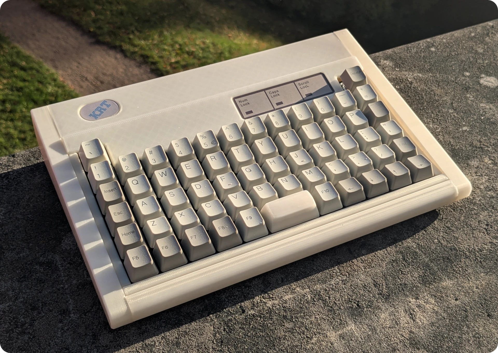
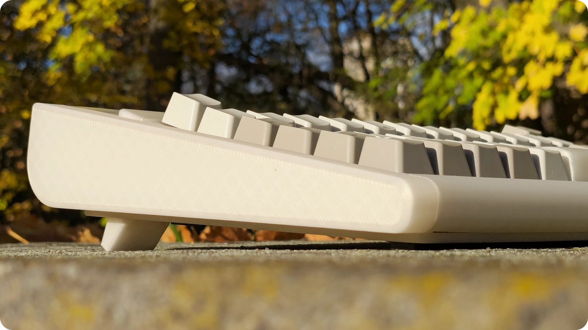
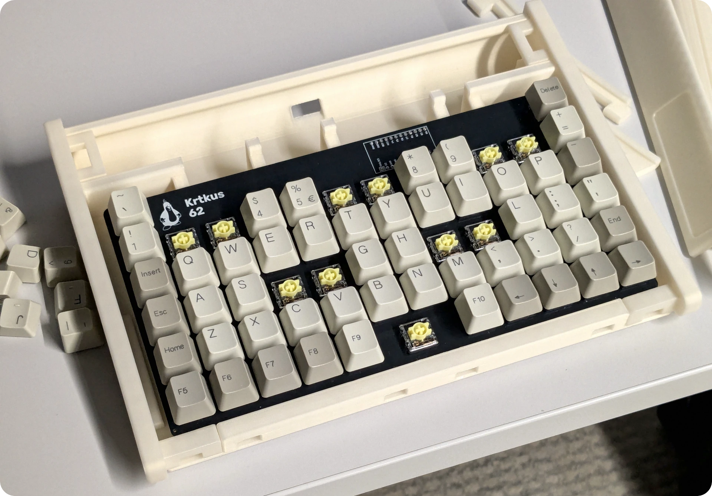
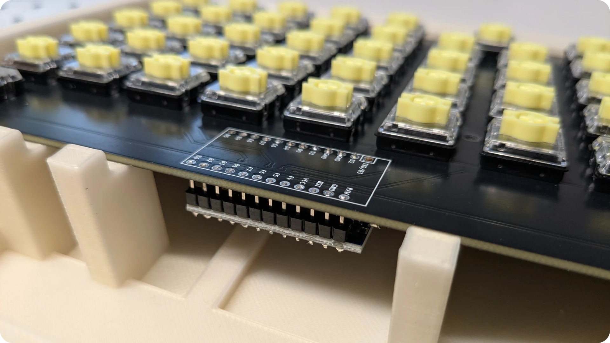

# Krtkus Retro Case

3D printed case for the [Krtkus](https://github.com/swift502/Krtkus) keyboard in the style of IBM Model M. With foldable feet!

The inner construction bends the PCB to give it some curvature, though a lot less than the original Model M. The LED indicators are also only decorative.

Overall the build is more of a concept for something I'd love to see manufactured properly by people who know what they're doing.

## Parts

- Printed [production](production/) files
- Modified build of the Krtkus PCB ([see below](#krtkus-differences))
- 5 M2 x 6mm screws
- Rubber feet

## Assembly

1. Connect a USB cable to the assembled Krtkus PCB
    - for a permanent USB cable, just pull the cable through the hole in the back of the case
    - alternatively you can get a short male-to-female USB extension and use the female end as an external USB port
2. Screw the assembled Krtkus PCB into the case base, it will bend to match the curvature of the support beams
3. Assemble the rest of the case, pieces fit into each other and lock in place, no glue needed
4. Stick the logo and indicator labels onto the case
5. Done!

As for keycaps, original Model M keycaps can be used if you 3D printed a switch stem adapter. The IBM Model M122 would be especially suitable because it has a 1U enter and backspace keys.

Alternatively, there's plenty of brand new retro-style MX keycap sets out there which should also look great.

## Krtkus differences

The only difference is that the Arduino has to be soldered from the bottom of the PCB, so the case can go over the top. Keep the orientation exactly the same so the pinout matches, just attach it from the bottom.

Try to keep the pins flush with the top of the PCB. There's only about 3mm of clearance between the top of the PCB and the case.

## Related projects

There's a famous deskthority thread of a 40% buckling spring board that I was definitely inspired by it so I want to leave it here as an acknowledgement that I wasn't the first to do something like this. I recommend you check it out if you haven't!

https://deskthority.net/viewtopic.php?t=27238

