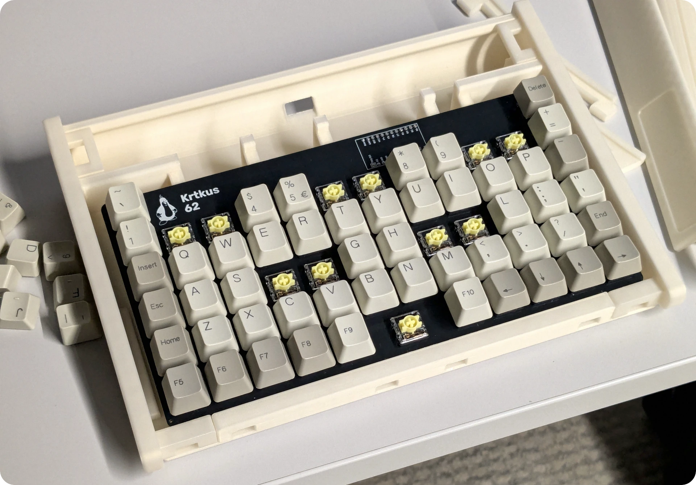
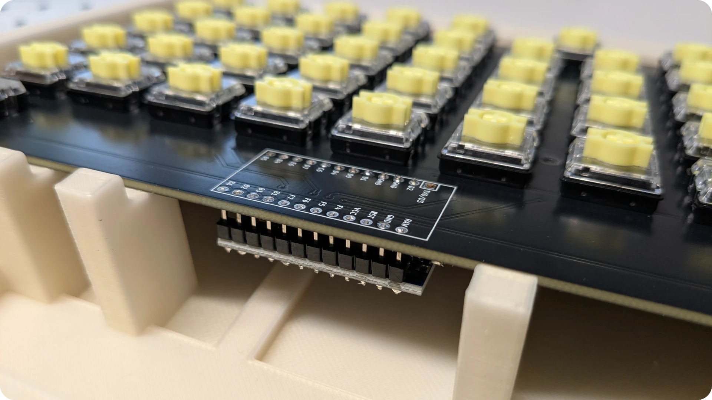
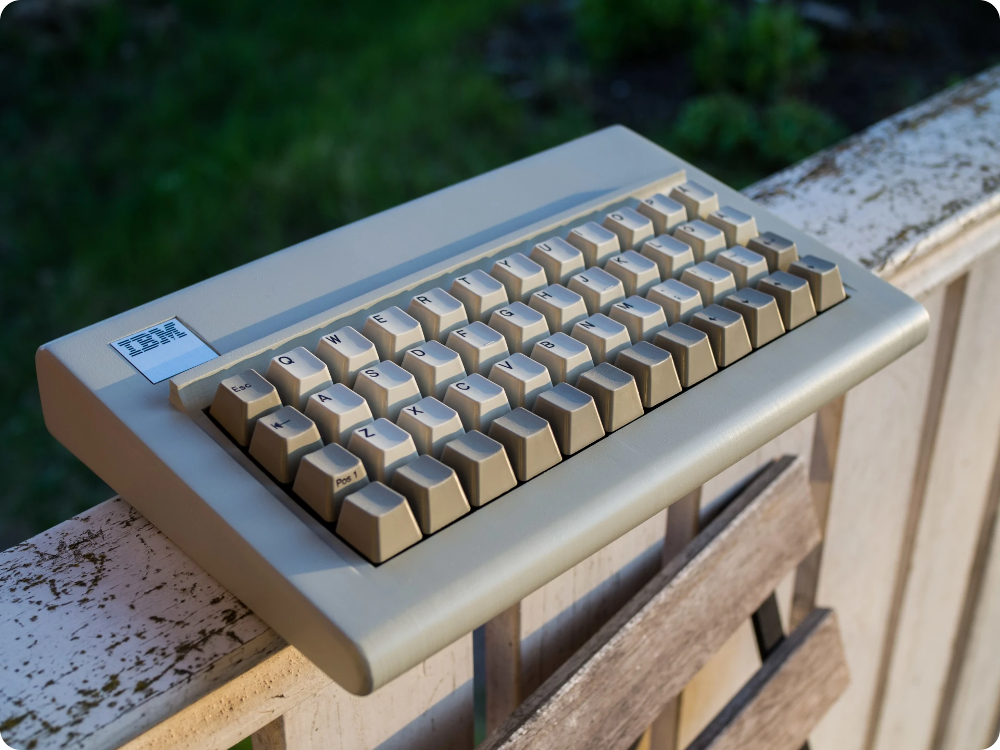

# Krtkus Retro Case

3D printed case for the [Krtkus](https://github.com/swift502/Krtkus) board in the style of IBM Model M.

Bends the PCB to give it some classic curvature. It's much more of a decorative piece than a high-quality case. The final build is essentially a mockup of something I'd love to see manufactured properly by people who know what they're doing.

## Parts

- Printed [gcodes](gcode/) and [decals](decals/)
- Modified build of the Krtkus PCB ([see below](#krtkus-differences))
- 5 M2 x 6mm screws

#### Optional:

- Rubber feet
- Coiled USB cable

## Build guide

1. Screw the assembled Krtkus PCB into the case base, it will bend to match the curvature of the support beams
2. Connect a USB cable and pull it through the hole in the back of the case
3. Assemble the rest of the case, pieces fit into each other and lock in place, no glue needed
4. Stick the logo and indicator labels onto the case
5. Done!

As for keycaps, original Model M keycaps can be used if you 3D printed a switch stem adapter. The IBM Model M122 would be especially suitable because it has a 1U enter and backspace keys, and a bunch of blanks you could use for the missing keys.

Alternatively, there's plenty of brand new retro-style MX keycap sets out there which should also look great.

## Krtkus differences

The only difference is that the Arduino has to be soldered from the bottom of the PCB, so the case can go over the top. Keep the orientation exactly the same so the pinout matches, just attach it from the bottom.

Try to keep the pins flush with the top of the PCB. There's only about 3mm of clearance between the top of the PCB and the case.

## Related projects

There's a famous deskthority thread of a 40% buckling spring board that I was definitely inspired by it so I want to leave it here as an acknowledgement that I wasn't the first to do something like this. I recommend you check it out if you haven't!

https://deskthority.net/viewtopic.php?t=27238

