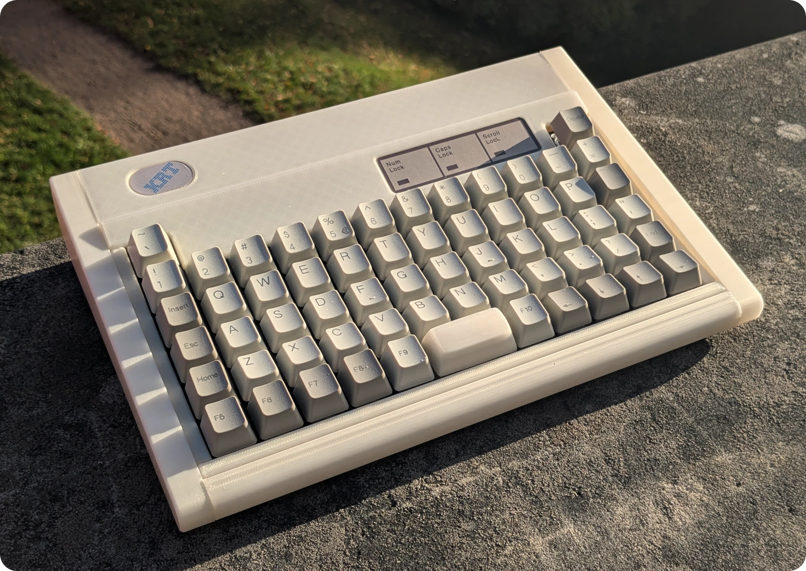
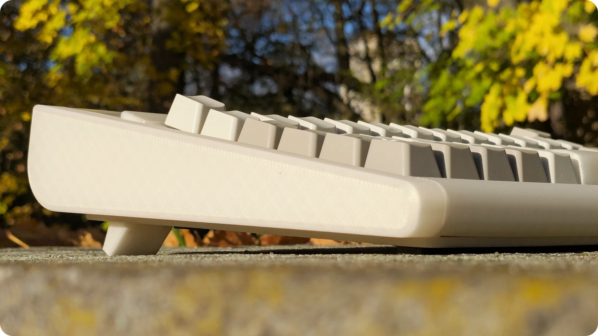
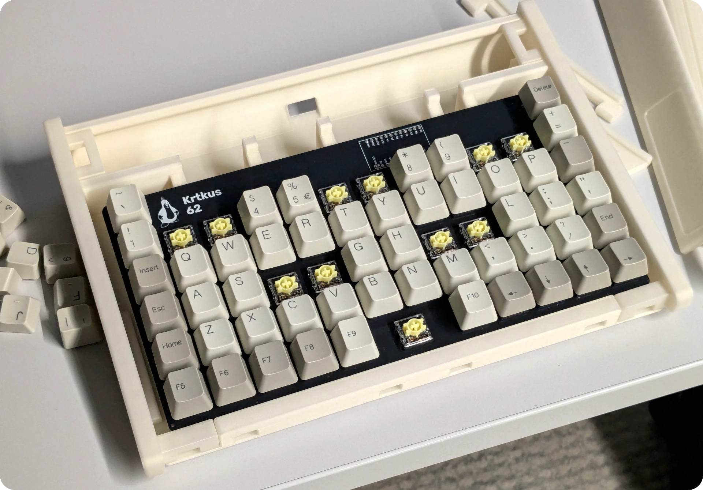
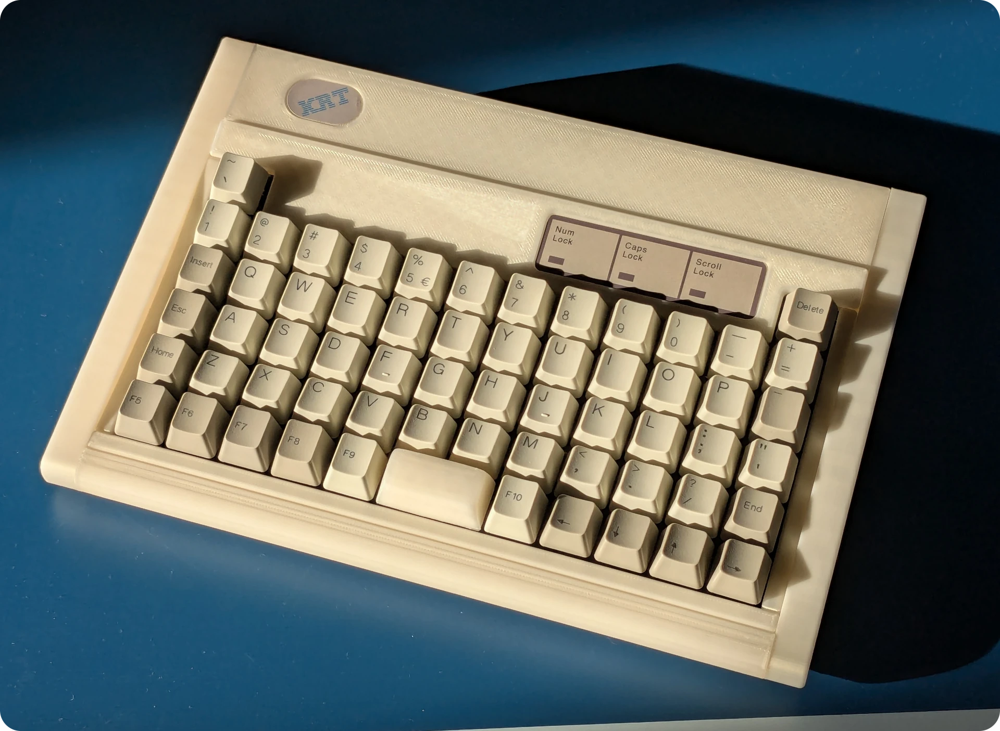
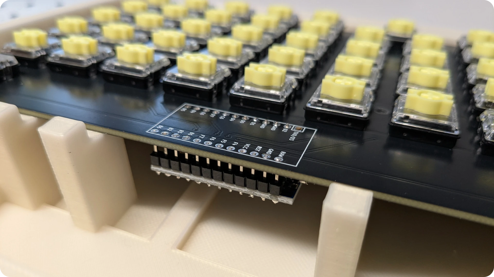
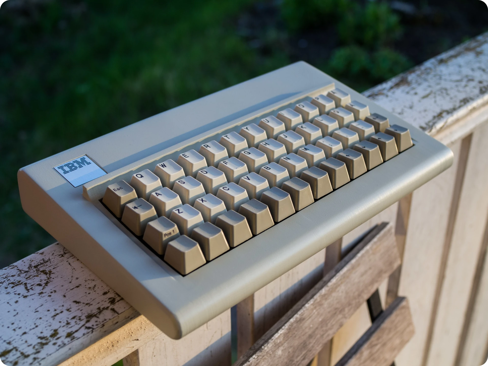

# Krtkus Retro Case

3D printed case for the [Krtkus](https://github.com/swift502/Krtkus) keyboard in the style of IBM Model M.

The inner construction bends the PCB to give it some curvature, though a lot less than the original Model M. The LED indicators are also only decorative.

Overall the build is more of a concept for something I'd love to see manufactured properly by people who know what they're doing. But it's pretty. And it has foldable feet!

<i>Prusament PLA Vanilla White, Dell AT101W keycaps</i>

## Parts

- Printed [production](production/) files
- Modified build of the [Krtkus](https://github.com/swift502/Krtkus) PCB ([see below](#krtkus-differences))
- 5 M2x6mm screws

#### Optional

- Rubber feet

## Assembly

1. Connect a USB cable to the assembled Krtkus PCB
    - for a permanent USB cable, just pull the cable through the hole in the back of the case
    - alternatively you can get a short male-to-female USB extension and use the female end as an external USB port
2. Screw the PCB into the case base, it will bend to match the curvature of the support beams
3. Assemble the rest of the case, pieces fit into each other and lock in place, no glue needed
4. Stick the logo and indicator labels onto the case

Done!

## Keycaps

As it stands, the Krtkus PCB only supports low-prifile Choc V1 or KS-33 switches. That means it natively only supports low profile keycaps. However, my build uses the Dell AT101W keycaps thanks to a 3D printed Alps-to-MX switch stem adapter.

Original Model M keycaps should hopefully also be possible to use with an adapter. The IBM Model M122 would be especially suitable because it has a 1U enter and backspace keys. Regular retro-style MX keycaps will definitely work but still require some stem height compensation.

To natively support other switches, a new versions of the Krtkus PCB would have to be created, which I'm currently not planning for, but it wouldn't be terribly difficult.

## Krtkus differences

The only difference from usual Krtkus assembly is that the Arduino has to be soldered from the bottom of the PCB, so the case can go over the top. Keep the orientation exactly the same so the pinout matches, just attach it from the bottom.

Try to keep the pins flush with the top of the PCB. There's only about 3mm of clearance between the top of the PCB and the case.

## Related projects

There's a legendary deskthority thread of a 40% buckling spring board that was much better made so I want to leave it here as an acknowledgement that I wasn't the first to do something like this. I recommend you check it out if you haven't!

https://deskthority.net/viewtopic.php?t=27238

